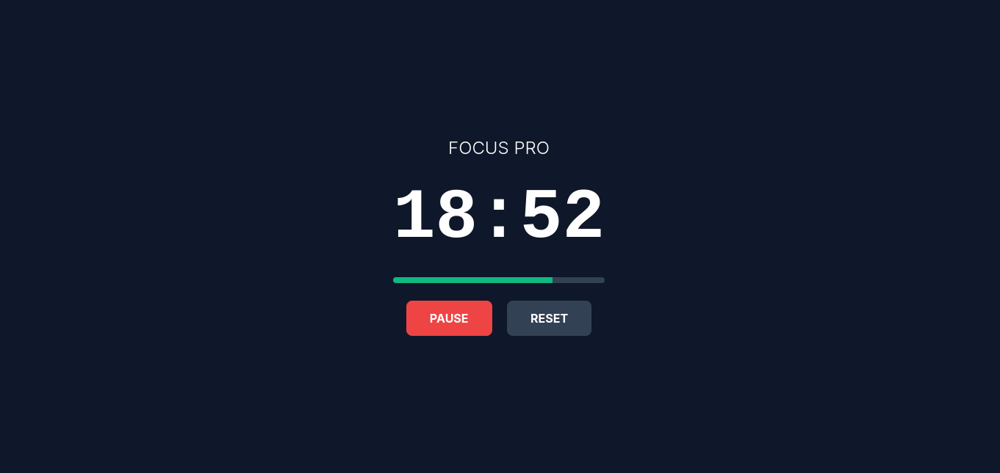

# Pomodoro Focus - Application de productivité Pomodoro

Pomodoro Focus est une solution web légère conçue pour aider les utilisateurs à appliquer la technique Pomodoro. L'application permet d'alterner des cycles de concentration intense et des périodes de récupération via une interface minimaliste et performante.

# Capture d'écran

## Fonctionnalités principales

- Gestionnaire de cycles : Alternance automatisée entre les phases de travail (25 minutes) et les pauses (5 minutes).
- Indicateur de progression : Barre visuelle dynamique permettant de suivre l'avancement de la session en cours.
- Contrôle du flux : Système de gestion des états permettant de démarrer, mettre en pause ou réinitialiser le chronomètre.
- Alertes audio : Notification sonore intégrée pour signaler la fin de chaque cycle.
- Interface optimisée : Design en mode sombre réalisé avec Tailwind CSS, adaptable sur tous les types d'écrans.

## Spécifications techniques

- Langage : JavaScript (ES6+) pour la gestion de la logique et du DOM.
- Style : Tailwind CSS pour une interface utilisateur moderne et réactive.
- Audio : API HTML5 Audio pour la gestion des notifications sonores.
- Déploiement : Hébergement optimisé sur GitHub Pages.

## Installation

Pour lancer le projet localement :
1. Cloner le dépôt.
2. Ouvrir le fichier index.html dans un navigateur web moderne.

## Objectifs du projet

Ce projet a été développé pour démontrer la maîtrise des fondamentaux du développement web front-end, notamment la manipulation du DOM, la gestion des intervalles de temps asynchrones et l'intégration de frameworks CSS utilitaires.
